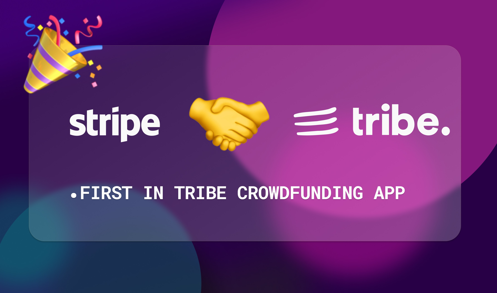

<p align="center">
  <a href="" rel="noopener">
 </a>
</p>
<h3 align="center">TRIBE CROWDFUNDING APP</h3>

<div align="center">

  <!-- [](http://hackathon.url.com) 
  []() 
  [](https://github.com/mjhatami/tribe-crowdfunding-app/issues)
  [](https://github.com/mjhatami/tribe-crowdfunding-app/pulls)
  [](LICENSE.md) -->

</div>

---

<p align="center"> Add payment section in your posts and manage it.
    <br> 
</p>

## 📝 Table of Contents
- [Problem Statement](#problem_statement)
- [Idea / Solution](#idea)
- [Dependencies / Limitations](#limitations)
- [Future Scope](#future_scope)
- [Setting up a local environment](#getting_started)
- [Usage](#usage)
- [Technology Stack](#tech_stack)
- [Contributing](../CONTRIBUTING.md)
- [Authors](#authors)
- [Acknowledgments](#acknowledgments)

## 🧐 Problem Statement <a name = "problem_statement"></a>
There is some cost of management for every community, so collecting and reporting in a transparent way is a traditional issue and there is a right for every person who pays, to get a transparent report in particular for charities. Furthermore, I saw Stripe integration in the Tribe roadmap on notion documents that needs product design and I think this can help this process.
- Collect money from members of a community and manage that in a transparent way.
- A dashboard for analyzing and reporting where money come and goes.
- Charities are a good target that increase the Tribe experience on how communities growth.


## 💡 Idea / Solution <a name = "idea"></a>
 Donation Box is an element in the post section. It manges how much money need for specific propose, which account achieved it and how much spend for the transaction fees and  .
 - Integrate with stripe connect
 - the Donation Box which helps you define a goal an then collect money for that.

## ⛓️ Dependencies / Limitations <a name = "limitations"></a>
This project is not production ready can need some development. I list some problem with .
- What are the dependencies of your project?
- Describe each limitation in detailed but concise terms
- Explain why each limitation exists
- Provide the reasons why each limitation could not be overcome using the method(s) chosen to acquire.
- Assess the impact of each limitation in relation to the overall findings and conclusions of your project, and if 
appropriate, describe how these limitations could point to the need for further research.

## 🚀 Future Scope <a name = "future_scope"></a>
- Multi currency must be checked and developed.
- Statistics dashboard for members and admins.
- Webhook to write a comment to thank the payers and mention them.
- Mongoose transaction must be added.
- User information must attached to the intents.
- Enable mongoose concurrency optimization.
Write about what you could not develop during the course of the Hackathon; and about what your project can achieve 
in the future.

## 🏁 Getting Started <a name = "getting_started"></a>
Firstly, the admins must create stripe account with activated connect.
- Admins:
    - Create a stripe account with activated connect.
    - Create webhook on Tribe specific url.
    - Set "client_secret", publish_key", "webhook_key" on tribe-crowdfunding-app.
    - Define fees by any condition their like.
- Members:
    - Go to profile and onboard on admin's stripe account.
    - Now, donation-box feature is available for them. Define amount of money that they need and write a description about what they want to do.

After these steps, others can choose what proportion of total money does they like to pay depends on  community policy and after that a payment gateway ready for them.

- Available endpoints (post man doc is provided):
  - Post create admin stripe config
  - Get existing admin stripe configs
  - Get retrieve or create onboarding account for members
  - Post create donation-box
  - Post create stripe intent by donation code

In client side of the app you can create intent and pay and the process is completed (Stripe webhook must be implemented to achieve intents status).

These instructions will get you a copy of the project up and running on your local machine for development 
and testing purposes. See [deployment](#deployment) for notes on how to deploy the project on a live system.

### Prerequisites

Just create an stripe account ,activate its stripe connect and run. 

```
docker-compose up
```

### Installing

I dockerized just for local installation, and this product need more development to be product 

Say what the step will be

```
docker-compose up
```

And repeat

```
until finished
```

## 🎈 Usage <a name="usage"></a>
Firstly, the admins must create stripe account with activated connect.
- Admins:
    - Create a stripe account with activated connect.
    - Create webhook on Tribe specific url.
    - Set "client_secret", publish_key", "webhook_key" on tribe-crowdfunding-app.
    - Define fees by any condition their like.
- Members:
    - Go to profile and onboard on admin's stripe account.
    - Now, donation-box feature is available for them. Define amount of money that they need and write a description about what they want to do.

After these steps, others can choose what proportion of total money does they like to pay depends on  community policy and after that a payment gateway ready for them.

- Available endpoints (post man doc is provided):
  - Post create admin stripe config
  - Get existing admin stripe configs
  - Get retrieve or create onboarding account for members
  - Post create donation-box
  - Post create stripe intent by donation code

In client side of the app you can create intent and pay and the process is completed (Stripe webhook must be implemented to achieve intents status).

## ⛏️ Built With <a name = "tech_stack"></a>
- [MongoDB](https://www.mongodb.com/) - Database
- [Express](https://expressjs.com/) - Server Framework
- [ReactJs](https://reactjs.org/) - Web Framework
- [NodeJs](https://nodejs.org/en/) - Server Environment
- [Stripe](https://stripe.com/) - Payment Infrastructure

## ✍️ Authors <a name = "authors"></a>
- [@mjhatami](https://github.com/mjhatami) - Idea & Initial work

See also the list of [contributors](https://github.com/mjhatami/tribe-crowdfunding-app/contributors) 
who participated in this project.

## 🎉 Acknowledgments <a name = "acknowledgments"></a>
- Thanks to my family for buying me a computer as a child. 
- [@mahmood-saghrajooghi](https://github.com/mahmood-saghrajooghi) Thanks for your generous help.
- [@syavash](https://github.com/syavash) Thanks for your worthy youtube tutorials in Persian.
- [@kylelobo](https://github.com/kylelobo/The-Documentation-Compendium) Thanks for your great readme templates.
- [tribe-starter-app](https://github.com/tribeplatform/tribe-starter-app) Thanks for your boilerplate.
- [tribe](https://tribe.so/) Thanks for your effect on society's subcultures.
- [stripe](https://stripe.com/) Thanks for your awesome payment platform.
